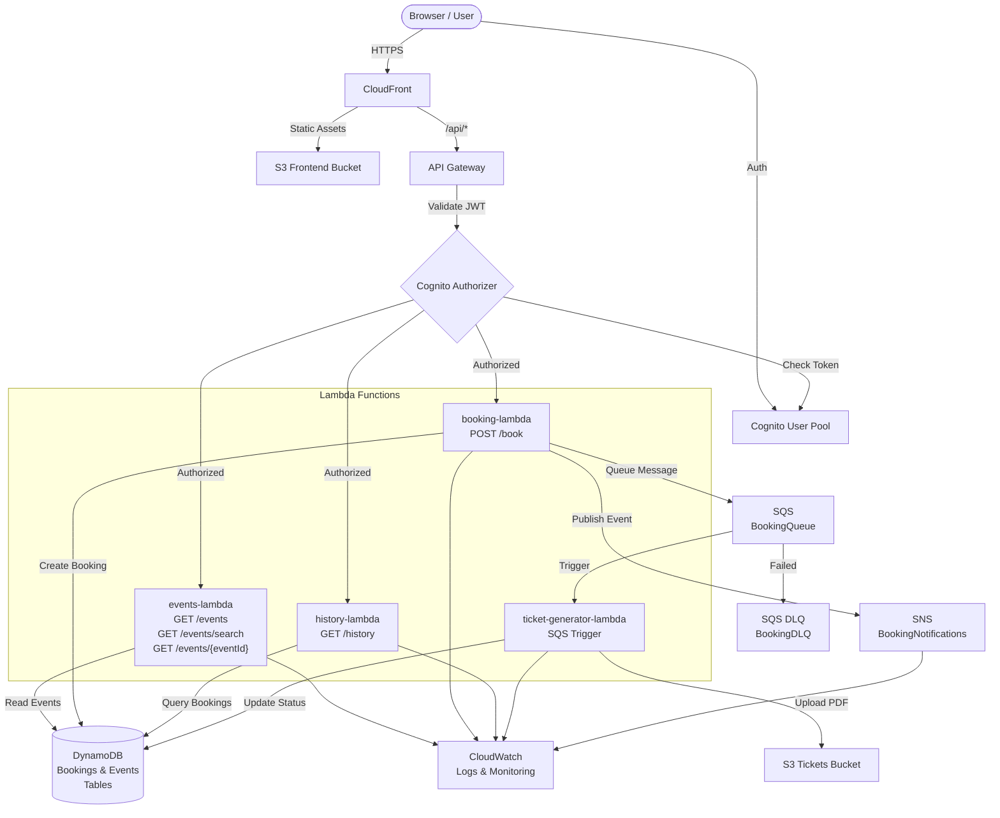

# Event Ticket Booking Platform

A production-grade serverless event ticketing system built with AWS and containerized for local development using Floci/LocalStack. Deploy locally in minutes, scale to AWS with no code changes.

## Architecture Overview



## Quick Start (Floci Local Development)

### Prerequisites
- **Podman** — For running Floci AWS emulator
- **Podman Compose** — Orchestrating Floci containers (`podman-compose` or `podman compose`)
- **Node.js 22.x** — Backend and frontend runtime
- **AWS SAM CLI** — Infrastructure deployment
- **AWS CLI v2** — Resource management (pointing to Floci)

### 1. Start Floci (AWS Emulator)

```bash
# Start all Floci services with podman-compose
podman-compose up -d

# Or if using newer Podman with built-in compose:
podman compose up -d

# Watch for health check (takes ~15-30 seconds)
podman-compose logs -f floci

# Verify it's ready
curl http://localhost:4566/_localstack/health
```

**What this does:**
- Starts LocalStack container (Floci) with Podman
- Exposes all AWS services on `localhost:4566`
- Enables persistent data storage
- Configures Lambda, DynamoDB, S3, SQS, SNS, Cognito, API Gateway, CloudWatch

### 2. Deploy to Floci

```bash
# Deploy entire application to Floci
bash scripts/deploy.sh
```

**What this does:**
1. Verifies Floci is running
2. Builds SAM template
3. Deploys infrastructure to Floci (CloudFormation)
4. Initializes DynamoDB with 4 sample events
5. Creates demo Cognito user
6. Builds React frontend
7. Uploads frontend to S3 (hosted on Floci)
8. Shows all endpoints and next steps

### 3. Run Frontend

```bash
cd frontend
npm install
npm start
```

The app opens at `http://localhost:3000`

### Demo Credentials
```
Email:    demo@example.com
Password: Demo@123456
```

### Cleanup

```bash
# Stop Floci
podman-compose down

# Remove persisted data (optional)
rm -rf floci-data/

# Or keep data for next session
# Data persists in ./floci-data/
```

## Project Structure

```
floci-event-book/
├── backend/
│   ├── booking-lambda/           # Handle POST /book requests
│   ├── events-lambda/            # Handle GET /events requests
│   ├── history-lambda/           # Handle GET /history requests
│   ├── ticket-generator-lambda/  # SQS-triggered PDF generation
│   ├── shared/                   # Shared utilities & AWS clients
│   ├── template.yaml             # AWS SAM Infrastructure as Code
│   └── package.json              # Node.js dependencies
│
├── frontend/
│   ├── public/                   # Static HTML
│   ├── src/
│   │   ├── pages/               # React pages (Login, Events, History)
│   │   ├── services/            # API & Cognito clients
│   │   ├── App.js               # Main React app
│   │   └── index.js             # Entry point
│   ├── .env                      # Runtime configuration
│   └── package.json              # React dependencies
│
├── scripts/
│   ├── deploy.sh                 # Bash deployment (macOS/Linux)
│   └── deploy.ps1                # PowerShell deployment (Windows)
│
├── docs/
│   ├── ARCHITECTURE.md           # Detailed architecture & data flows
│   ├── DEPLOYMENT.md             # Step-by-step deployment guide
│   ├── TESTING.md                # Test strategies & examples
│   └── TROUBLESHOOTING.md        # Common issues & solutions
│
└── infrastructure/
    └── README.md                 # Infrastructure as Code notes
```

## Core Features

### Authentication
- **Amazon Cognito** user pool for signup/signin
- JWT token generation and validation
- Secure token storage in browser
- Automatic token refresh

### Event Management
- List all available events
- Search events by name/category
- View detailed event information
- 4 sample events pre-loaded

### Ticket Booking
- Select event and quantity
- Instant booking confirmation
- Payment tracking (price × quantity)
- SNS notifications on booking

### Ticket Generation
- Automatic PDF ticket generation
- Upload to S3 with user/booking organization
- DynamoDB status tracking (PENDING → PROCESSING → CONFIRMED)
- Download links in booking history

### Booking History
- View all user bookings
- Filter by status (pending, processing, confirmed)
- Download PDF tickets for confirmed bookings
- View booking statistics

## Technology Stack

| Component | Technology |
|-----------|-----------|
| **Backend Runtime** | Node.js 22.x |
| **API** | AWS API Gateway + AWS Lambda |
| **Database** | Amazon DynamoDB |
| **Authentication** | Amazon Cognito |
| **Async Processing** | Amazon SQS + Amazon SNS |
| **Storage** | Amazon S3 |
| **CDN** | Amazon CloudFront |
| **Infrastructure** | AWS SAM (CloudFormation) |
| **Frontend** | React 18 + Axios + AWS Cognito SDK |
| **Local Environment** | LocalStack (Floci) |

## AWS Service Summary

| Service | Purpose | Local Testing |
|---------|---------|---------------|
| **API Gateway** | HTTP API endpoint & request routing | ✓ Floci |
| **Cognito** | User authentication & JWT tokens | ✓ Floci |
| **Lambda** | Serverless compute (4 functions) | ✓ Floci |
| **DynamoDB** | NoSQL database (bookings, events) | ✓ Floci |
| **SQS** | Async task queue + DLQ | ✓ Floci |
| **SNS** | Event notifications | ✓ Floci |
| **S3** | Frontend hosting + ticket storage | ✓ Floci |
| **CloudFront** | CDN for frontend | ✓ Floci |
| **CloudWatch** | Structured logging & monitoring | ✓ Floci |
| **IAM** | Least-privilege access control | ✓ Floci |

## Data Models

### Bookings Table (DynamoDB)
```json
{
  "userId": "user-uuid",
  "bookingId": "BOOK-20250601T120000Z-abc123",
  "eventId": "event-1",
  "eventName": "Summer Music Festival",
  "eventDate": "2025-07-15",
  "quantity": 2,
  "totalPrice": 199.98,
  "status": "CONFIRMED",
  "ticketUrl": "s3://tickets-bucket/tickets/user-uuid/booking-id.pdf",
  "userEmail": "user@example.com",
  "createdAt": "2025-06-01T12:00:00Z",
  "updatedAt": "2025-06-01T12:05:00Z"
}
```

### Events (In-Memory)
```json
{
  "eventId": "event-1",
  "name": "Summer Music Festival",
  "description": "3-day music festival with top artists",
  "date": "2025-07-15",
  "location": "Central Park, NYC",
  "category": "Music",
  "ticketPrice": 99.99,
  "totalCapacity": 5000,
  "available": 3240,
  "image": "https://example.com/festival.jpg"
}
```

## API Endpoints

All endpoints (except `/auth/*`) require Cognito JWT in `Authorization: Bearer <token>` header.

### Authentication (Public)
- `POST /auth/signup` — Create new user account
- `POST /auth/signin` — Get JWT token
- `POST /auth/refresh` — Refresh expired token

### Events (Public)
- `GET /events` — List all events
- `GET /events?search=query` — Search events
- `GET /events/{eventId}` — Get event details

### Bookings (Authenticated)
- `POST /book` — Create new booking
  ```json
  {
    "eventId": "event-1",
    "quantity": 2
  }
  ```
- `GET /history` — Get user's booking history

## Cost Analysis

### Running Locally (Floci)
- **Cost:** $0
- **Reason:** All AWS services are emulated locally with no charges

### Running on AWS (Estimated Monthly)

Assumptions:
- 100 active users
- 10,000 bookings/month
- 500 events list views/month
- Average 2 tickets/booking

| Service | Cost |
|---------|------|
| **Lambda** | $2.00 (4 functions × monthly invocations) |
| **DynamoDB** | $3.25 (on-demand, write capacity) |
| **SQS** | $0.40 (10K msgs @ $0.40/million) |
| **SNS** | $0.50 (notifications) |
| **S3** | $0.50 (10K PDFs, ~1MB each) |
| **CloudFront** | $12.00 (1GB data transfer) |
| **API Gateway** | $2.50 (100K requests) |
| **Cognito** | $0.15 (100 active users) |
| **CloudWatch** | ~$1.00 (logs, metrics) |
| **Total** | **~$21-30/month** |

**Note:** AWS Free Tier covers most of these services for new accounts (12 months).

## AWS Deployment (Future Reference)

This project is designed for **Floci local development**. To deploy to actual AWS in the future:

1. Update `scripts/deploy.sh` to use AWS endpoints instead of Floci
2. Set AWS credentials via `aws configure`
3. Run: `sam build && sam deploy --guided`

See [docs/DEPLOYMENT.md](docs/DEPLOYMENT.md) for production deployment reference.

## Testing

### Unit Tests
```bash
cd backend
npm test
```

### Integration Tests
```bash
# Test all API endpoints
bash ../scripts/test-apis.sh
```

### End-to-End Tests
```bash
cd frontend
npm run test:e2e
```

See [docs/TESTING.md](docs/TESTING.md) for comprehensive testing strategy.

## Troubleshooting

### Common Issues

**Floci won't start:**
```bash
# Check if port 4566 is in use
netstat -an | grep 4566  # macOS/Linux
netstat -ano | findstr :4566  # Windows

# Try different port
docker run -d -p 5000:4566 localstack/localstack
```

**Lambda timeout errors:**
- Increase timeout in `template.yaml` (default: 30s)
- Check DynamoDB table status
- Monitor CloudWatch logs

**Frontend can't reach API:**
- Verify `REACT_APP_API_ENDPOINT` in `frontend/.env`
- Check API Gateway is running: `aws --endpoint-url=http://localhost:4566 apigateway get-rest-apis`
- Enable CORS if needed

See [docs/TROUBLESHOOTING.md](docs/TROUBLESHOOTING.md) for detailed solutions.

## Monitoring & Logs

### View CloudWatch Logs
```bash
# All Lambda logs
aws --endpoint-url=http://localhost:4566 logs tail /aws/lambda --follow

# Specific function
aws --endpoint-url=http://localhost:4566 logs tail /aws/lambda/booking-lambda --follow
```

### Enable Debug Logging
```bash
# Backend: set LOG_LEVEL=DEBUG in template.yaml
# Frontend: set REACT_APP_DEBUG=true in .env
```

### X-Ray Tracing (Production)
```bash
aws xray get-trace-summaries \
  --start-time $(date -u -d '10 minutes ago' +%s) \
  --end-time $(date -u +%s)
```

## Contributing

1. Create a feature branch: `git checkout -b feature/my-feature`
2. Make changes and test locally
3. Commit with clear messages: `git commit -m "feat: add ticket filtering"`
4. Push and create pull request

## Documentation

- **[Podman Setup Guide](PODMAN_SETUP.md)** — Complete Podman installation and configuration
- **[Floci Guide](FLOCI_GUIDE.md)** — Comprehensive LocalStack/Floci reference with AWS CLI examples
- [Architecture Details](docs/ARCHITECTURE.md) — System design, data flows, AWS service configs
- [Deployment Guide](docs/DEPLOYMENT.md) — Step-by-step local deployment with Podman
- [Testing Strategy](docs/TESTING.md) — Unit, integration, E2E, performance, security testing
- [Troubleshooting Guide](docs/TROUBLESHOOTING.md) — Common issues and solutions

## Security

- **Authentication:** AWS Cognito JWT tokens with expiry
- **Authorization:** API Gateway authorizers validate JWT on each request
- **Encryption:** TLS/HTTPS for all data in transit
- **Data Protection:** DynamoDB encryption at rest, S3 versioning
- **Least Privilege:** IAM roles scoped to minimum required permissions
- **Input Validation:** All API inputs validated before processing

See [docs/ARCHITECTURE.md#security](docs/ARCHITECTURE.md) for security details.

## License

This project is provided as-is for learning and demonstration purposes.

## Support

For issues or questions:
1. Check [docs/TROUBLESHOOTING.md](docs/TROUBLESHOOTING.md)
2. Review CloudWatch logs: `aws logs tail /aws/lambda --follow --endpoint-url=http://localhost:4566`
3. Enable debug logging and retry
4. Review [docs/TESTING.md](docs/TESTING.md) for test commands

## Version History

| Version | Date | Changes |
|---------|------|---------|
| 1.0.0 | 2025-06-09 | Initial release - complete serverless platform |

---

**Built with ❤️ for serverless AWS development**
# event-booking-floci

