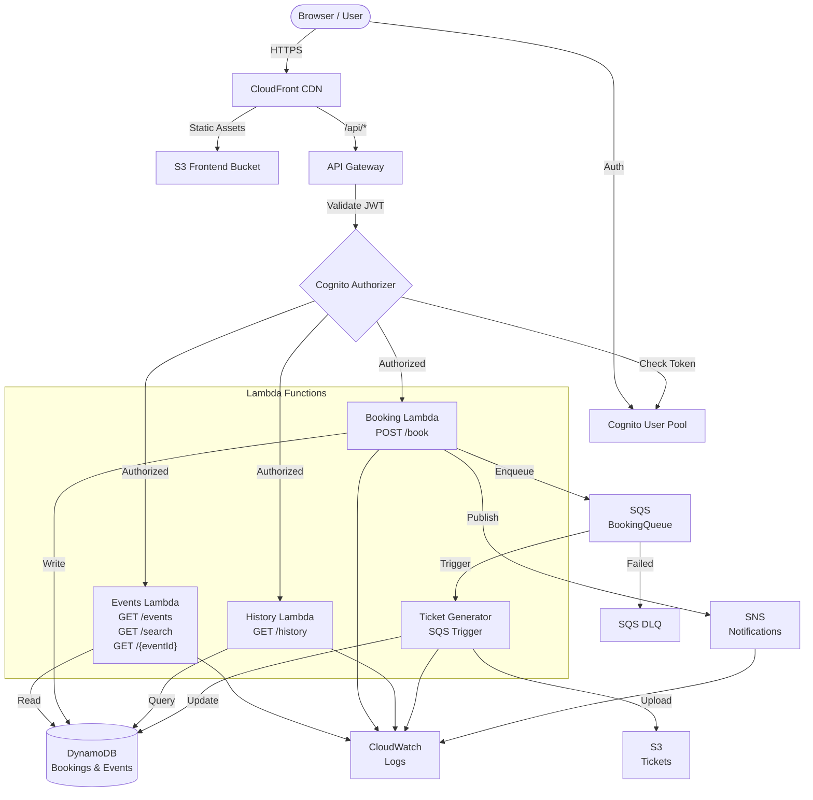

# Event Ticket Booking Platform

## Architecture Overview

This is a production-grade serverless Event Ticket Booking Platform built on AWS services, fully containerized with Floci, and deployable to AWS with minimal changes.

## System Architecture



## AWS Services Used

| Service | Purpose |
|---------|---------|
| **API Gateway** | REST API endpoint, request routing, authorization |
| **Cognito** | User authentication, JWT token management |
| **Lambda** | Serverless compute for all business logic |
| **DynamoDB** | NoSQL database for bookings and events |
| **SQS** | Asynchronous message queue for ticket generation |
| **SNS** | Publish/subscribe for notifications |
| **S3** | Frontend hosting and ticket storage |
| **CloudFront** | CDN for frontend delivery and caching |
| **CloudWatch** | Logs, metrics, and monitoring |
| **IAM** | Role-based access control |

## Data Flow

### 1. User Authentication Flow
```
User → Login Page → Cognito → JWT Token → LocalStorage
```

### 2. Event Discovery Flow
```
User (Authenticated) → API Gateway → Events Lambda → Mock Data → Response
```

### 3. Ticket Booking Flow
```
User → Book Event → API Gateway → Booking Lambda
  → DynamoDB (Create Booking)
  → SNS (Publish Notification)
  → SQS (Send Message)
  → Response (Booking Confirmation)
```

### 4. Ticket Generation Flow
```
SQS Message → Ticket Generator Lambda
  → Generate PDF
  → S3 (Upload Ticket)
  → DynamoDB (Update Status)
  → Ticket Ready for Download
```

### 5. Booking History Flow
```
User → API Gateway → History Lambda → DynamoDB Query → Bookings List
```

## DynamoDB Design

### Bookings Table

**Table Name:** `Bookings`
**Billing Mode:** Pay-Per-Request (auto-scaling)

**Partition Key (HASH):** `userId` (String)
**Sort Key (RANGE):** `bookingId` (String)

**Key Design Rationale:**
- `userId` as partition key enables efficient queries for user's bookings
- `bookingId` as sort key ensures unique booking identification
- This design supports the query: "Get all bookings for user X"
- Supports efficient scan operations by user

**Attributes:**
```json
{
  "userId": "user123",
  "bookingId": "BOOK-1234567890-ABC123",
  "eventId": "event-001",
  "eventName": "Summer Music Festival",
  "eventDate": "2026-07-15",
  "quantity": 2,
  "status": "CONFIRMED",
  "totalPrice": 199.98,
  "ticketUrl": "s3://event-tickets-123-us-east-1/tickets/user123/BOOK-1234567890-ABC123.pdf",
  "createdAt": "2026-06-09T10:30:00Z",
  "updatedAt": "2026-06-09T10:32:00Z"
}
```

**Global Secondary Indexes (GSI):**
- Optional: `eventId-bookingId` for queries like "Get all bookings for an event"

**TTL:** Not enabled (bookings retained indefinitely)

## SQS Design

### Booking Queue

**Queue Name:** `BookingQueue`
**Queue Type:** Standard Queue
**Visibility Timeout:** 300 seconds (5 minutes)
**Message Retention Period:** 345,600 seconds (4 days)
**Max Receive Count:** 3

### Booking Queue DLQ

**Queue Name:** `BookingQueueDLQ`
**Message Retention:** 1,209,600 seconds (14 days)
**Purpose:** Stores messages that failed after 3 retries

**Retry Behavior:**
1. Message published to queue
2. Lambda triggered (visibility timeout: 5 minutes)
3. Lambda processes - success → message deleted
4. Lambda processes - failure → message returned to queue
5. After 3 failed attempts → message sent to DLQ
6. DLQ messages can be reprocessed or investigated

**Message Format:**
```json
{
  "bookingId": "BOOK-1234567890-ABC123",
  "userId": "user123",
  "eventId": "event-001",
  "eventName": "Summer Music Festival",
  "quantity": 2,
  "totalPrice": 199.98,
  "userEmail": "user@example.com",
  "createdAt": "2026-06-09T10:30:00Z"
}
```

## SNS Design

### Booking Notifications Topic

**Topic Name:** `BookingNotifications`
**Type:** Standard Topic
**Display Name:** `Booking Notifications`

**Subscribers:**

1. **Email Subscription**
   - Endpoint: `bookings@example.com`
   - Sends email notifications for every booking
   - Can be filtered by booking status

2. **Lambda/SQS Subscription**
   - Can trigger additional processing
   - Can log to external systems

3. **CloudWatch Logs Subscription**
   - All notifications logged for audit trail

**Message Format:**
```json
{
  "bookingId": "BOOK-1234567890-ABC123",
  "userId": "user123",
  "userEmail": "user@example.com",
  "eventId": "event-001",
  "eventName": "Summer Music Festival",
  "quantity": 2,
  "totalPrice": 199.98,
  "createdAt": "2026-06-09T10:30:00Z"
}
```

## Lambda Functions

### 1. Events Lambda (`events-lambda`)
- **Handler:** `index.handler`
- **Runtime:** Node.js 22.x
- **Memory:** 256 MB
- **Timeout:** 30 seconds

**Endpoints:**
- `GET /events` - List all events
- `GET /events/{eventId}` - Get event details
- `GET /events/search?q=query` - Search events

**Permissions:**
- DynamoDB: Read `EventsTable`
- CloudWatch: Write logs
- X-Ray: Write traces

### 2. Booking Lambda (`booking-lambda`)
- **Handler:** `index.handler`
- **Runtime:** Node.js 22.x
- **Memory:** 256 MB
- **Timeout:** 30 seconds
- **Trigger:** API Gateway (POST /book)
- **Authorization:** Cognito User Pool

**Workflow:**
1. Extract user from Cognito JWT
2. Validate booking request
3. Check event availability
4. Create booking in DynamoDB
5. Publish SNS notification
6. Send SQS message for ticket generation
7. Return booking confirmation

**Permissions:**
- DynamoDB: Write `BookingsTable`, Read `EventsTable`
- SQS: Send message to `BookingQueue`
- SNS: Publish to `BookingNotificationTopic`
- CloudWatch: Write logs
- X-Ray: Write traces

### 3. History Lambda (`history-lambda`)
- **Handler:** `index.handler`
- **Runtime:** Node.js 22.x
- **Memory:** 256 MB
- **Timeout:** 30 seconds
- **Trigger:** API Gateway (GET /history)
- **Authorization:** Cognito User Pool

**Workflow:**
1. Extract user from Cognito JWT
2. Query bookings for user from DynamoDB
3. Calculate booking statistics
4. Return formatted booking history

**Permissions:**
- DynamoDB: Query `BookingsTable`
- CloudWatch: Write logs
- X-Ray: Write traces

### 4. Ticket Generator Lambda (`ticket-generator-lambda`)
- **Handler:** `index.handler`
- **Runtime:** Node.js 22.x
- **Memory:** 512 MB
- **Timeout:** 60 seconds
- **Trigger:** SQS `BookingQueue`
- **Batch Size:** 10 messages
- **Batch Window:** 5 seconds

**Workflow:**
1. Receive booking message from SQS
2. Update booking status to PROCESSING in DynamoDB
3. Generate PDF ticket
4. Upload PDF to S3
5. Update booking status to CONFIRMED
6. Store ticket URL in DynamoDB

**Permissions:**
- SQS: Receive, delete messages from `BookingQueue`
- DynamoDB: Update `BookingsTable`
- S3: Put object to `TicketsBucket`
- CloudWatch: Write logs
- X-Ray: Write traces

## Cognito Setup

### User Pool
- **Name:** `EventBookingUserPool`
- **Password Policy:** Minimum 8 characters
- **MFA:** Disabled (can be enabled for production)
- **Attributes:** Email (required), Name (optional)

### User Pool Client
- **Name:** `EventBookingClient`
- **Authentication Flows:**
  - USER_PASSWORD_AUTH
  - REFRESH_TOKEN_AUTH
  - USER_SRP_AUTH
- **OAuth2 Flows:**
  - Authorization Code
  - Implicit
- **Scopes:** openid, email, profile
- **Callback URLs:**
  - http://localhost:3000/callback
  - http://localhost:3000

## S3 Buckets

### Frontend Bucket
- **Name:** `event-booking-frontend-{ACCOUNT-ID}-{REGION}`
- **Website Configuration:** Enabled
- **Index Document:** `index.html`
- **Error Document:** `index.html` (SPA routing)
- **Public Access:** Enabled via bucket policy

### Tickets Bucket
- **Name:** `event-tickets-{ACCOUNT-ID}-{REGION}`
- **Versioning:** Enabled
- **Public Access:** Blocked (private tickets)
- **Lifecycle:** Delete old tickets after 90 days

## CloudFront Distribution

**Origin:** S3 Frontend Bucket

**Cache Behaviors:**
- Default: 86,400 seconds (24 hours)
- Index.html: 0 seconds (no cache, always fresh)

**Compression:** Enabled (gzip)

**HTTPS:** CloudFront default certificate

**Custom Error Responses:**
- 404 → index.html (SPA routing)
- 403 → index.html (SPA routing)

## Error Handling

### Validation Errors (400)
```json
{
  "error": {
    "code": "VALIDATION_ERROR",
    "message": "Invalid request parameter",
    "requestId": "uuid",
    "timestamp": "2026-06-09T10:30:00Z"
  }
}
```

### Not Found Errors (404)
```json
{
  "error": {
    "code": "NOT_FOUND",
    "message": "Resource not found",
    "requestId": "uuid",
    "timestamp": "2026-06-09T10:30:00Z"
  }
}
```

### Server Errors (500)
```json
{
  "error": {
    "code": "INTERNAL_ERROR",
    "message": "Internal server error",
    "requestId": "uuid",
    "timestamp": "2026-06-09T10:30:00Z"
  }
}
```

## Logging & Monitoring

### CloudWatch Logs
All Lambda functions write to CloudWatch Logs in structured JSON format:

```json
{
  "timestamp": "2026-06-09T10:30:00Z",
  "level": "INFO",
  "message": "Booking created successfully",
  "requestId": "uuid",
  "bookingId": "BOOK-123",
  "userId": "user123",
  "eventId": "event-001"
}
```

### Log Groups
- `/aws/lambda/event-booking-events`
- `/aws/lambda/event-booking-book`
- `/aws/lambda/event-booking-history`
- `/aws/lambda/event-booking-ticket-generator`

### X-Ray Tracing
All Lambda functions emit traces to X-Ray for distributed tracing and performance analysis.

## Security Considerations

### Authentication & Authorization
- JWT tokens validated by API Gateway Authorizer
- Cognito manages user credentials
- Least privilege IAM roles for each Lambda

### Data Protection
- DynamoDB encryption at rest (default)
- S3 encryption for tickets
- HTTPS for all API calls
- Private subnets (when deployed to VPC)

### Rate Limiting
- API Gateway throttling
- SQS queue limits prevent abuse
- Cognito rate limiting on auth endpoints

### Input Validation
- All inputs validated before processing
- SQL injection prevention (using parameterized queries)
- XSS prevention (React escaping)
- CSRF tokens (implicit in SPA with same-domain API)

## Cost Analysis

### Running on Floci (Local Development)
- **Cost:** $0
- **Reason:** All services are emulated locally
- **Benefit:** Unlimited testing without AWS costs

### Estimated Monthly Cost on AWS

**Assumptions:**
- 100 active users
- 10,000 bookings/month
- 2,000 active searches/month
- 5 bookings/day average

**Breakdown:**

| Service | Monthly Cost | Calculation |
|---------|-------------|-------------|
| Lambda | $3.50 | 10,000 invocations + 2,000 searches = 12,000 × $0.0000002 + 50MB × 0.000000417 |
| DynamoDB | $5.00 | Pay-per-request: Read/Write capacity |
| SQS | $0.40 | 10,000 messages × $0.00004/message |
| SNS | $0.50 | 10,000 notifications × $0.00005/notification |
| S3 | $2.00 | 10,000 tickets × 100KB avg = 1GB storage |
| CloudFront | $5.00 | ~10,000 requests × $0.075/10K |
| API Gateway | $3.50 | 12,000 requests × $0.00035/request |
| Cognito | $0.50 | First 50,000 MAUs free, then $0.0055/MAU |
| CloudWatch | $0.50 | Logs retention |

**Total Estimated Monthly Cost: ~$21.40**

**Notes:**
- All prices assume us-east-1 region
- Prices subject to change
- Free tier benefits may apply
- Volume discounts available for higher usage

## Deployment

See [DEPLOYMENT.md](DEPLOYMENT.md) for complete deployment instructions.

## Testing

See [TESTING.md](TESTING.md) for comprehensive testing guide.

## Troubleshooting

See [TROUBLESHOOTING.md](TROUBLESHOOTING.md) for common issues and solutions.
